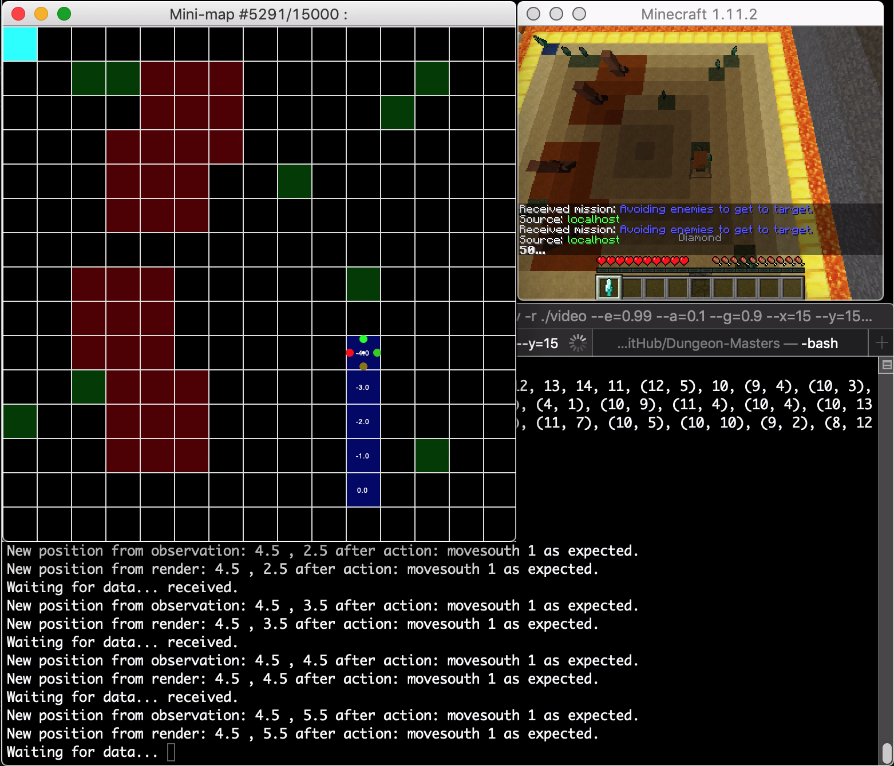
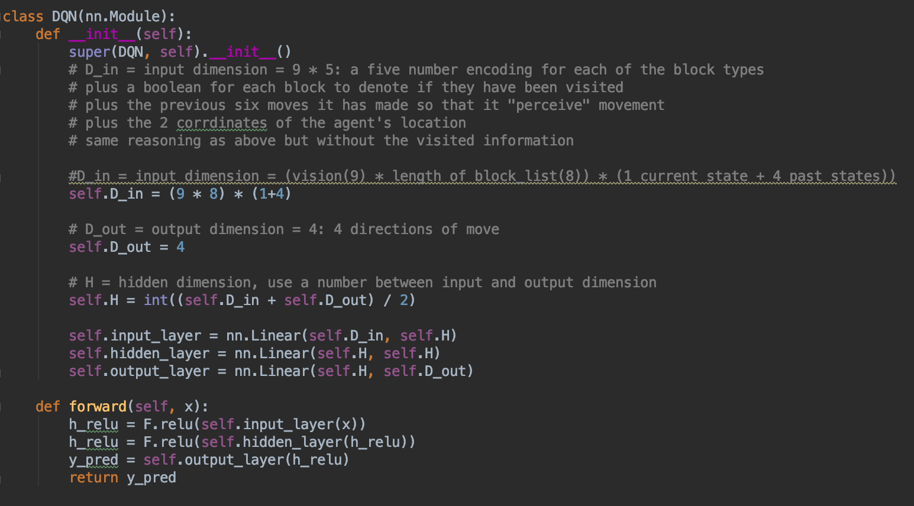
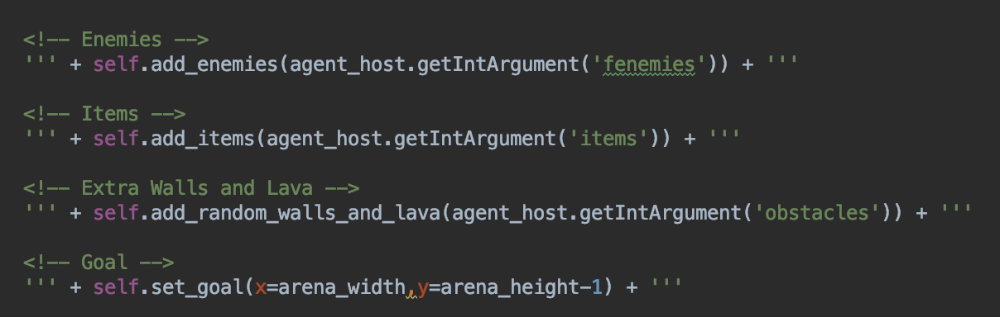
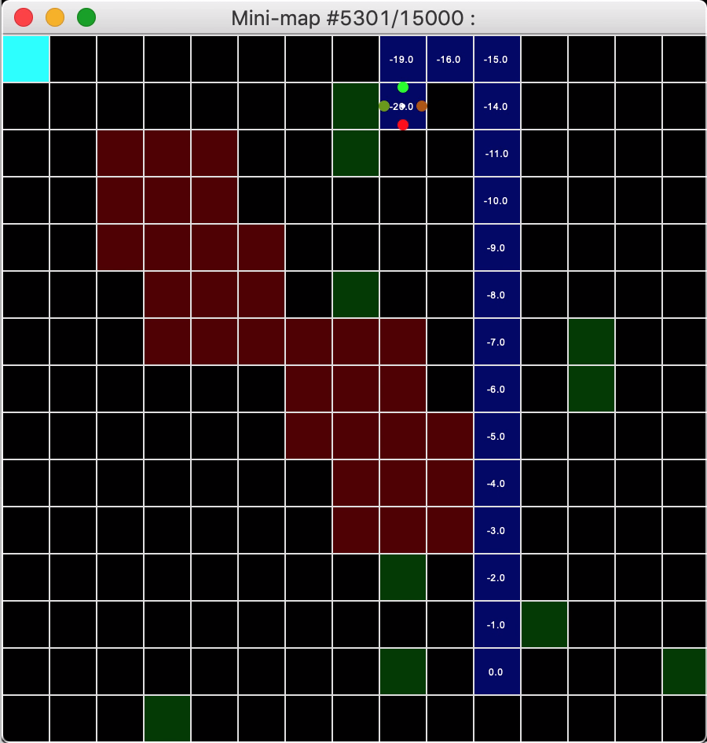
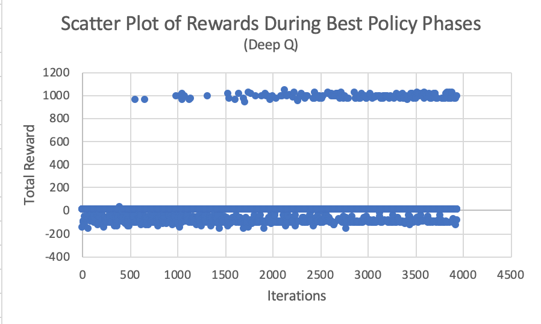
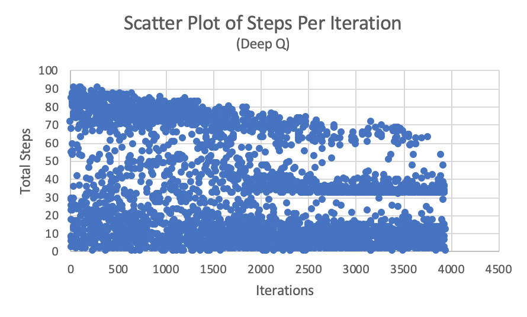
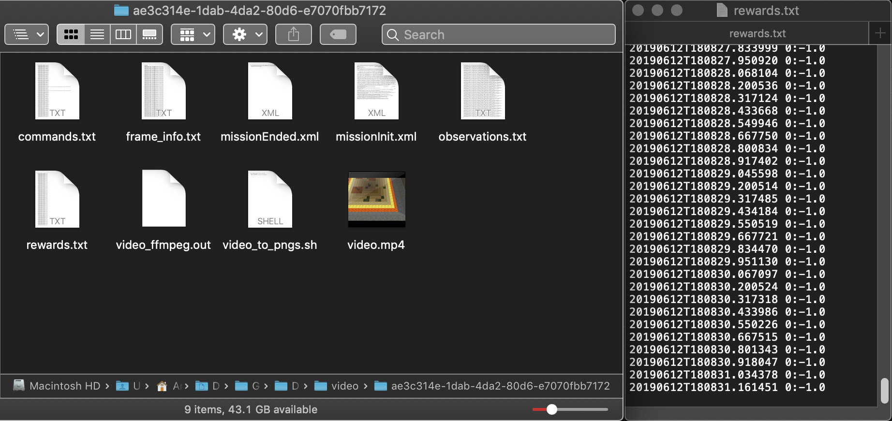

## Video
<iframe width="100%" height="400" src="https://www.youtube.com/embed/bh9HQMejJsA" frameborder="0" allow="accelerometer; autoplay; encrypted-media; gyroscope; picture-in-picture" allowfullscreen></iframe>

## Project Summary
Have you ever wanted to be the best stealth dungeon master without knowing the dungeon itself? Learn with our own agents as we take on the dungeon master’s puzzles and learn how to reach the treasure at the end of the path while sneaking past various beasts and monsters, and grabbing collectables that increase your score on the way!

Our goal in this project is to create an agent that will train to solve a dungeon by avoiding conflict rather than with conflict. These dungeons will have various features such as obstacles, lava, monsters, small collectable rewards along the way, a giant treasure at the end of the path, and much more. The agent's goal is to minimize the amount of travel while maximizing the number of rewards he gets along the way. The agent is a modern pacifist Indiana Jones.

Our goal is to create an agent that can solve the dangerous dungeons that lie ahead. These dungeons feature lava, walls, and enemies that it has to sneak around and a bright, blue diamond in the end hoisted an a very rare and expensive lapiz block. 

## Approaches
Our project was divided into two stages: tabular q-learning and deep q-learning(dqn).

### Tabular q-learning 
For our first approach, we used tabular q-learning to train the agent. There are 4 actions that the q-table outputs: move north, east, south, and west. The states of the table are the paths that the agent has taken so far. Within the map, there are enemies that have a certain vision radius. If the agent enters the vision radius, it dies and obtains a large number of negative points. If the agent encounters the boundary of the map, it obtains a large number of negative points but it keeps going. At the end of each run, the q-table gets updated and the agent becomes more inclined to take the routes with higher overall points. Given this information the agent would always take the shortest path from start to end (while avoiding the enemies vision radius). To make the scenario more interesting we added small rewards in the shape of diamonds along the maze as rewards. This adds a lot more complexity to the agents decision making as now he longer wants the shortest path. Once we added intermediate rewards and increased the maze size to 40x20 blocks and more the runtime shot up exponentially. This huge increase in runtime lead us to switch over to deep q-learning. 

Our tabular q-learning phase was covered in our [Status Report](../status.html).

(Click below to view the video...)

### Deep q-learning
The problem with tabular q-learning is that with bigger maps, it is spatially inefficient to train; the q-table would be massive. Furthermore, its current implementation only takes into account the location of the agent, not its surroundings. We want to use deep q-learning to take into account the blocks in the immediate vicinity, or “vision”, of the agent to train it to avoid specific blocks regardless of location. We also want the agent to learn in a more general way. In other words, we want the agent to be able to solve any maze based on its surrounds and not rely on its position and memorize a specific route for a single maze.

Our DQN uses a dual neural network to learn its surroundings. Both neural networks have the same format. One input layer with 360 nodes, one output layer with 4 nodes, and one hidden layer wit 182 nodes. We used an RELU activation function to connect the nodes together. 

First, let's explain why the input layer needed 360 nodes. We gave the agent the ability to “see” a 3x3 grid of block with itself at the center. We then took the 9 blocks and made a one-hot encoding of it, flattened it, and passed it into the neural network we made. There are 8 types of blocks that the agent can see, so a one-hot encoding will make each block an array of 0s with only a 1 to specify which of the 8 blocks was seen. Since there are 9 blocks that agent can see, one state takes up 72 nodes. However, we also made sure that the agent “remembers” the past 4 states so we also pass the previous 4 states along with the current state into the neural network. This is so that agent can perceive “movement” rather than just a still image.

Secondly, the output layer has 4 nodes to correspond to each of the 4 possible actions: movenorth 1, movesouth 1, movewest1, moveeast1.

Lastly, the hidden layer has 182 nodes because we just took the average number of nodes between the input and output layer to determine the number of nodes we need.

_Above: The source code of the neural network class that was used by PyTorch._

While the agent is running, if the agent sees a wall, we made the wall out of gold blocks, and the agent makes a move towards the wall, we make the agent take a different move. We do not allow the agent to move into the wall. Within the walls, there will be enemies scattered around that have there surrounding 9 blocks be marked, with red_sandstone, as their vision. If the agent enters said vision, the agent loses 100 points and dies. Also scattered around the area are checkpoints, marked with grass. When agent walks over the grass, agent gets 20 points and the checkpoint disappears. When the agent reaches the goal marked with a lapis_block, agent receives 10000 points. Also, for each move that the agent makes, the agent loses 1 point.

We use a double neural net during the DQN: a policy and target model. The policy model takes in the state and outputs an estimated q-value for each action. Then, we need to calculate the loss. However, to calculate the loss, we need to use maximum q-value of the next time step, or target q-value. In the tabular-q-learning version, we just looked at the q-table to get the value. However, with DQN, we need to pass in this next time step back into the network to get the maximum q-value. The problem occurs during the second pass. After the first pass, the neural net updates its weights. This is so that with each pass to the neural net, out q-values will be closer to the target q-values. However, since the second pass is made with update weights, the target q-values will move too. This is not what we desire. We want the target q-values to be calculated with the previous weights of the network. This is why we used the second neural net, the target model. The target model will be a copy of the policy model before the first pass so it will retain the same weights. We then use the target model to calculate the target q-value to compute the loss for that time step. After the loss is calculated, then we update the target model to have the same weights as the policy model.

To make sure that the agent is learning based on his surroundings, we made the enemies spawn the random locations at the beginning of every run. We also had the agent have a decaying epsilon. On the very first run, the agent has an epsilon of 1.0 so it will always make a random move. As the agent makes more runs, we decay the epsilon at the rate of 0.001%, i.e. we multiply epsilon by 0.999. This will gradually decrease epsilon so the more runs that have passed by, the less likely the agent will make a random move, and instead make the optimal move. However, we also do not let the epsilon to drop pas 0.001. Once is has dropped passed that threshold, epsilon will be held constant there after.

_Above: The high-level source code of the XML random generation of various map features._

## Evaluation
For our evaluation, we used qualitative and quantitative methods to determine if our agent was working correctly.

### _Qualitative Methods_
Our agent can be observed in two ways:
1. A mini-map, which shows the position of the agent and its visited block in the world as well as the position of the special blocks described in the rewards table below in the “Rewards System section; and the resulting reward of going in one of four discrete directions, the reward being denoted by text and the most optimal action by a colored circle.
2. The game screen/canvas, which shows the agent traversing a physical representation of the world. 

_Above: The mini-map used to assist in the observation of the agent's progress visually._

One can see the mini-map representation as an x-ray of the game canvas. The mini-map assists the observer in showing the most optimal path from the starting block to the goal block, denoted by a chain of dark blue blocks representing the agent’s path history. Visually, the agent can be deemed as optimal if it takes very little time to find the goal, as shown in our time remaining counter in the canvas and the minimal number of blue blocks shown on the mini-map.

### _Quantitative Methods_
Our agent can be observed through recorded methods provided by Malmo. For each iteration, Malmo saves a .tgz file which contains information including but not limited to rewards and observations after all steps. 

#### Iterations vs Steps/Rewards
Using a Python program to read this data, we conceived a simple graph, where:
1. _x_ is the number of iterations, and _y_ is the number of steps taken until the mission ended.
2. _x_ is the number of iterations, and _y_ is the resulting reward at the end of the mission.
Inferring from the graphs, one can notice the steady convergence in the number of steps as deep-Q learning decides to take the best-policy path to the goal over time. Also observe the cluster of positive rewards consistently appearing over iterations as the best-policy path is realized over time.

#### Data Parser Program
The Python program is represented  in one module, video_to_plot.py. 

As previously described, Malmo saves .tgz files into a folder, in which we can then process with our Python program. Specifically, for each .tgz file in our video folder “./video”, we open the rewards.txt file and extract the final reward and number of steps from the file. Then, we compile the data into .csv file in which we can make graphs analyzing the trends in the learning process.

The module also takes an optional argument that lets us only save specific iterations. This allows us to save only iterations that have the best policy, eliminating the noise from the exploratory phases of deep-q learning.

#### Rewards System
Finally, our rewards system for deep-q learning looks as follows:

| Block Type    | Reward        |
| ------------- |--------------:| 
| Yellow Sand Block (Normal) | 0 |
| Blue Lapis Block (Goal)     | 1000      | 
| Green Grass Block (Bonus items) | 20 |
| Red Sandstone Block (Vision radius) | -100     |  
| Any Block (Movement from block A to B) | -1 |

There also exists special conditions:
- If a green grass block is stepped on by the agent, the block will change into a yellow sand block when the agent leaves.
- If time expires, the mission ends without additional penalty.
- If the mission passes with time remaining, the mission ends without additional rewards.
- Diamonds are cosmetic and do not represent rewards, its reward simply represented by the green grass block.

In the future, we would want to add other types of blocks for interest; but in general, the three types of blocks described above suffice for our problem statement at the high level.

## References and Special Thanks
The following resources were used to create this version of Dungeon-Masters:
- The project base was Microsoft’s Malmo Q-learning example. (https://github.com/microsoft/malmo)
- Campuswire helped us solve Malmo issues that increases during the development of our mission environment.
- Professor Singh and TA Stephen were instrumental in reforming our proposal to be of smaller scope/doable.
- We scrambed all over the Pytorch manual documentation and discussion forums. (https://pytorch.org/)
- DeepLizard tutorial on DQN concepts (http://deeplizard.com/learn/playlist/PLZbbT5o_s2xoWNVdDudn51XM8lOuZ_Njv)
- Image of the header image on the main page. (https://www.flickr.com/photos/brandenkp/6374895301)
