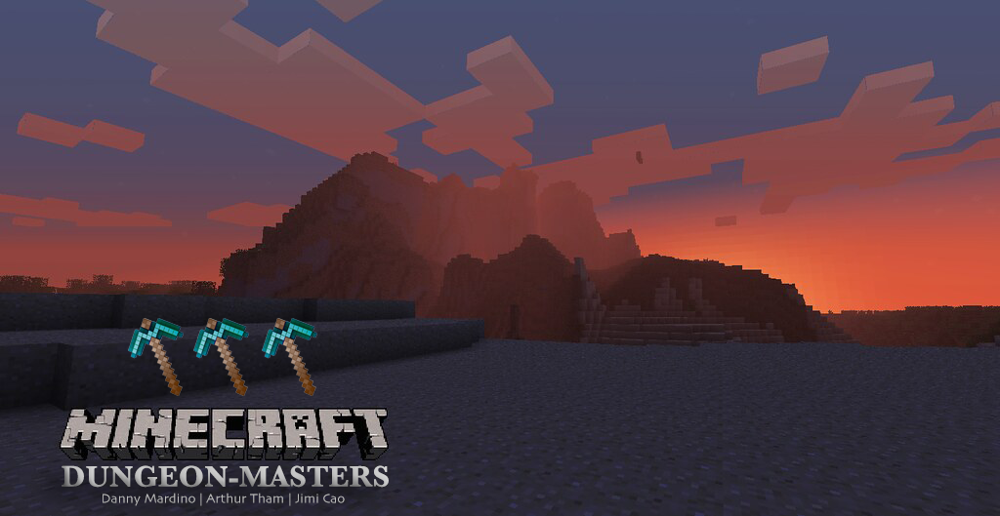

## Reports:

- [Proposal](proposal.html)
- [Status](status.html)
- [Final](final.html)
- [Source Code](https://github.com/dannym08/Dungeon-Masters)

## About Dungeon-Masters
Have you ever wanted to be the best stealth dungeon master without knowing the rules? Learn with our own agents as we take on the dungeon master's puzzles and learn how to reach the treasure at the end of the path while sneaking past various beasts and monsters!

Our goal in this project is to create an agent that will train to solve a dungeon by avoiding conflict rather than with conflict. These dungeons will have various features such as obstacles, lava, monsters, small rewards along the way, giant treasure at the end of the path, and much more. The agents goal is to minimize the ammount of travel he agent has to use, while maximing the ammount of rewards he gets along the way. The agent is a modern pacifist Indianna Jones.
## Video

## Photos

<!--
What's Markdown (`.md`)?

Markdown is markup that lets you write hypertext (HTML) documents
in easy-to-read and easy-to-write plain text.
No angle brackets `<></>` required for
paragraphs, lists, blockquotes, tables, etc.

This is a paragraph (in Markdown). Some more
text here.

This is another paragraph.

This is a list:

- Orange
- Apple
- Blueberry

$$x^2 = y^2$$

Just getting started with Markdown?
See the [HTML <-> Markdown Quick Reference (Cheat Sheet)][quickref].

[quickref]: https://github.com/mundimark/quickrefs/blob/master/HTML.md
-->

