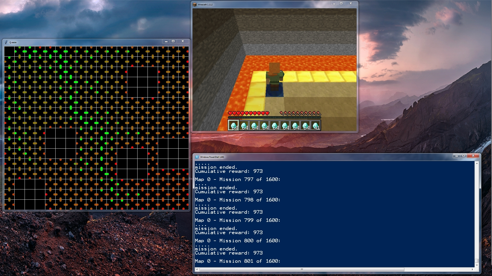
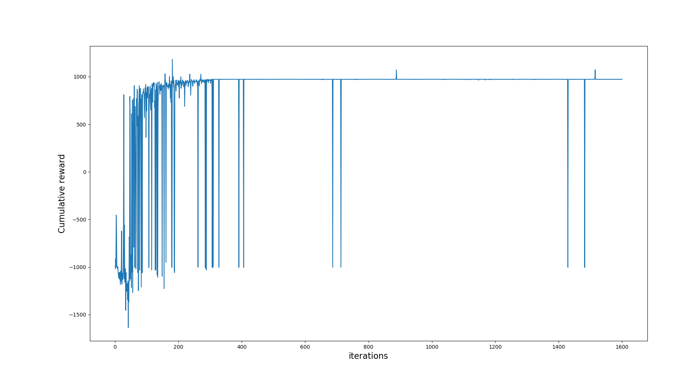

## Video
Click below to view the video...

## Project Summary
Have you ever wanted to be the best stealth dungeon master without knowing the rules? Learn with our own agents as we take on the dungeon master’s puzzles and learn how to reach the treasure at the end of the path while sneaking past various beasts and monsters!

Our goal in this project is to create an agent that will train to solve a dungeon by avoiding conflict rather than with conflict. These dungeons will have various features such as obstacles, lava, monsters, small rewards along the way, giant treasure at the end of the path, and much more. The agent's goal is to minimize the amount of travel he agent has to use while maximizing the number of rewards he gets along the way. The agent is a modern pacifist Indiana Jones.

## Approach
For our approach, we used tabular q-learning to train the agent. There are 4 actions that the q-table outputs: move north, east, south, and west. The states of the table are the paths that the agent has taken so far. Within the map, there are enemies that have a certain vision radius. If the agent enters the vision radius, it dies and obtains a large number of negative points. If the agent encounters the boundary of the map, it obtains a large number of negative points but it keeps going. At the end of each run, the q-table gets updated and the agent becomes more inclined to take the routes with higher overall points.

## Evaluation
For our evaluation, we used qualitative and quantitative methods to determine if our agent was working correctly.

### _Qualitative Methods_

Our agent can be observed in two ways:
1. A Q-table, which shows the position of the agent in the world and the resulting reward of going in one of four discrete directions, the reward being denoted by color.
2. The game screen/canvas, which shows the agent traversing a physical representation of the world.

One can see the Q-table representation as an x-ray of the game canvas. Eventually, the Q-table will clearly show the most optimal path from the starting block to the goal block, denoted by a chain of green dots. Visually, the agent can be deemed as optimal if it takes very little time to find the goal, as shown in our time remaining counter in the canvas.

### _Quantitative Methods_

Our agent can be observed through recorded methods provided by Malmo. For each iteration, Malmo saves a .tgz file which contains information including but not limited to rewards and observations after all steps. Using a Python program to read this data, we conceived a simple graph, where:
1. x is the number of iterations, and y is the number of steps taken until the mission ended.
2. x is the number of iterations, and y is the resulting reward at the end of the mission.

Inferring from the graphs, one can notice the steady decline in the number of steps as Q-learning decides to take the best-policy path to the goal over time. Also, notice that the resulting reward remains constant at “99” early on when it is determined where the guaranteed path to the goal is.

Finally, our rewards system looks as follows:

| Block Type    | Reward        |
| ------------- |--------------:|
| Lava (Instant death)     | -1000 |
| Lapis Block (Goal)     | 1000      |
| Getting the diamond (Goal) | 100 |
| Red Sandstone (Vision radius) | -1000     |  
| Gold Block (Wall) | -75 |
| Any Block (add to all values above) | -1 |  

Below is a figure that shows the cumulative reward of a sample run over 1600 iterations. For this run you can see the agent converges to the max reward farily quickly.

## Remaining Goals and Challenges
We first need to convert our tabular q-learning to deep q-learning. Then, allow the agent to see around him and take the surrounding into account before making a move. Next, we need to fine tune the reward system because currently, positive rewards causes the agent to be stuck. And then, we need to extend the range in which the agent can see ahead. Finally, we will allow the enemy’s vision area to change In the moonshot case, we will add additional levels (above/below) to the explorable area.

## Resources Used
The following resources were used to create this version of Dungeon-Masters:
- The project base was Microsoft’s Malmo Q-learning example.
- Campuswire helped us solve Malmo issues that increases during the development of our mission environment.
- Professor Singh and the staff were instrumental in reforming our proposal to be of smaller scope/doable.
